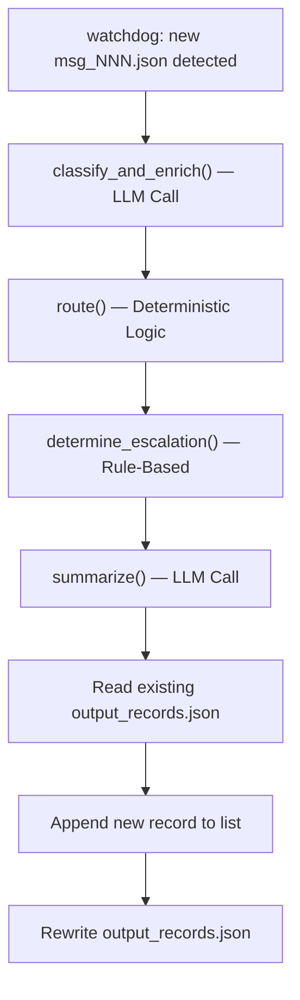

# ArcVault Triage Pipeline: System Architecture

This document provides a comprehensive overview of the design, routing mechanisms, escalation policies, production considerations, and future roadmap of the ArcVault Intake & Triage Pipeline.

---

## 1. System Design

The current implementation of the triage pipeline is built as a single Python script (`pipeline.py`) running in an event-driven watch mode. A `watchdog` observer monitors the `inbox/` folder and fires a handler for each new `msg_NNN.json` file, processing messages individually and incrementally as they arrive.

*   **Ingestion**: The script reads individual customer messages from JSON files (`msg_NNN.json`) in the `inbox/` folder. In default watch mode, it uses the `watchdog` library to monitor the folder and automatically ingest new files as they are created.
*   **Classification & Enrichment**: The message is sent to the Gemini API (`gemini-3.1-flash-lite`) via the `classify_and_enrich()` function to extract category, priority, confidence, and entities.
*   **Routing**: The enriched data is passed to `route()` to determine the destination queue.
*   **Escalation**: As part of routing, the script determines if the message requires immediate escalation via `determine_escalation()`.
*   **Summary**: A second LLM call (`summarize()`) creates a customized summary based on the routing destination.
*   **State Management**: The pipeline processes messages file-by-file and appends each new record incrementally to `output/output_records.json`. The `watchdog` observer enables the system to update state live without requiring an orchestrator or script restart.

---

## 2. Routing Logic

The routing of processed tickets is defined by the `ROUTING_MAP` dictionary in `pipeline.py`:
*   `Bug Report` & `Incident/Outage` $\rightarrow$ **`Engineering`**
*   `Feature Request` $\rightarrow$ **`Product`**
*   `Billing Issue` $\rightarrow$ **`Billing`**
*   `Technical Question` $\rightarrow$ **`IT/Security`**

### Deterministic vs. LLM-Decided Routing
A key architectural decision was to perform the final routing via **deterministic Python logic** rather than relying on the LLM to output the queue name directly. 
*   **Auditability & Verification**: Routing rules are explicit and can be unit-tested programmatically. We can guarantee that any message classified as a "Billing Issue" *always* lands in the "Billing" queue.
*   **Prompt Drift Prevention**: Relying on an LLM for final routing exposes the system to prompt drift. If a new model version is deployed or the prompt is modified slightly, the LLM might hallucinate a new queue name (e.g., "Finance" instead of "Billing").
*   **Decoupling**: Separating classification (understanding the ticket) from routing (assigning the ticket) allows us to change our internal team structures and routing rules instantly in Python code without retraining or refactoring prompts.

---

## 3. Escalation Logic

The `determine_escalation()` function acts as a safety-critical override to flag high-risk tickets for the `Escalation/Human Review` queue. It evaluates four distinct criteria:

1.  **Low Model Confidence (`confidence < 0.70`)**: If the Gemini model's confidence in its classification is low, the ticket is escalated. The `0.70` threshold was chosen as a balance: it is high enough to catch ambiguous, garbled, or multi-topic messages, but low enough to prevent flooding human agents with highly certain classifications.
2.  **Keyword Matching (`ESCALATION_KEYWORDS`)**: We check the raw message for high-severity phrases (e.g., `"outage"`, `"security breach"`, `"data breach"`, `"cannot access at all"`). This acts as a regex-based fallback to guarantee immediate attention for security or operational crises.
3.  **Outage Impact Detection**: If the category is classified as `Incident/Outage` and the raw text mentions `"multiple users"`, it triggers an escalation. This isolates widespread platform outages from single-user bugs.
4.  **Billing Discrepancy Threshold (`> $500.00`)**: For billing issues, the function parses dollar amounts, calculates the discrepancy (the difference between the max and min detected amounts), and escalates if it exceeds `$500.00`. This ensures high-value disputes (such as Invoice #8821 disputing $1,240 vs $980) get senior eyes immediately, while small discrepancies are routed standardly.

> [!NOTE]
> The low-confidence escalation path is fully implemented and unit-testable. However, it was not naturally triggered by the 5 clean sample messages, as the model's confidence scores naturally landed in the high `0.95–0.98` range.

---

## 4. Production Scale Considerations

To scale this synchronous prototype to a production environment handling thousands of requests, several key changes are required:

*   **Message Queue & Orchestration**: The synchronous loop in `main()` must be replaced by an asynchronous event-driven consumer (using RabbitMQ, AWS SQS, or Kafka). Incoming messages from emails or web forms would be pushed to an ingestion queue, ensuring no tickets are lost in-memory if the service restarts.
*   **API Rate Limits & Cost Management**: Gemini's free tier has request-per-minute (RPM) and request-per-day (RPD) limits. The `call_llm()` function already implements basic rate limit handling for `gemini-3.1-flash-lite` (a 4-second delay before every call, plus exponential backoff with a retry-after hint on 429/5xx errors). In production, we would use a paid tier and implement token-bucket rate-limiting, request batching for non-urgent tickets (to reduce costs), and caching for identical inquiries.
*   **Idempotency & Deduplication**: To prevent duplicate API charges and ticket creation, we need a deduplication layer (e.g., Redis). Every incoming message must be hashed, and duplicate hashes within a sliding window (e.g., 5 minutes) must be discarded.
*   **Observability & Drift Monitoring**: We must log and monitor the distribution of the model's `confidence` scores and `category` predictions over time. A sudden drop in average confidence or a skew in predictions would flag prompt drift or changes in customer behavior, indicating a need to update prompts or fine-tune models.

---

## 5. Phase 2 Roadmap (Next Actions)

Given another week to develop this triage pipeline, I would prioritize the following enhancements:

1.  **Stricter Schema Validation with Pydantic**: Replace manual dictionary parsing and assertions with a schema-enforcement library. Utilizing Gemini’s `response_schema` parameter with Pydantic would ensure the LLM's output matches our structure exactly before any downstream routing logic executes.
2.  **Fine-grained Queue Sub-routing**: Expand the routing rules to subdivide high-level queues. For example, parse the `IT/Security` queue to split pre-sales SSO setup questions (routing to Solutions Engineering) from potential security vulnerabilities (routing to Security Incident Response).
3.  **Human-in-the-Loop Feedback Loop**: Build a simple feedback interface for support managers to correct misclassified tickets. This telemetry would be logged to calculate historical accuracy and dynamically adjust the confidence escalation threshold (e.g., moving it from `0.70` to `0.75` if too many misclassified bugs bypass human review).
4.  **Production Orchestrator Integration**: Migrate the workflow logic from raw Python scripts to a robust orchestration engine like **Temporal** or **AWS Step Functions**. This ensures reliable state management, automatic retires, timeout controls, and granular visibility for each step of the pipeline.